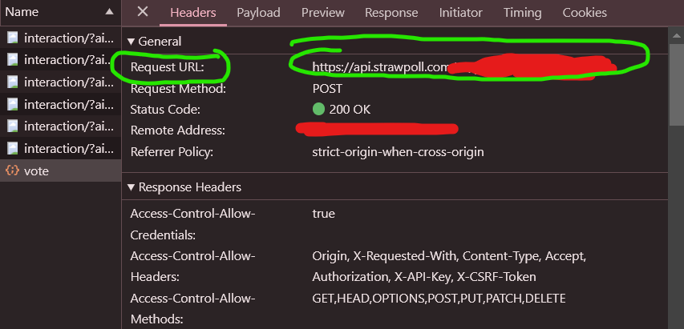
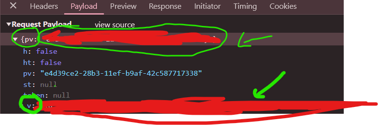

# Strawpoll Voting Bot

This is a Python-based voting bot for Strawpoll that can automate the voting process. There are two versions of the bot:

1. **Voting Bot with Tor**: Uses the Tor network to change IP addresses after each vote.
2. **Voting Bot without Tor**: Votes multiple times from the same IP address, assuming multiple votes are allowed from one device.

## Features

- Automatically retrieves the CSRF token needed for voting.
- Configurable options through a `vote_details.json` file.
- Ability to vote multiple times with or without IP rotation.
- Logs each successful vote to a `vote_count.txt` file with timestamps.

## Requirements

- Python 3.10 or higher
- Required Python packages:
  - `requests`
  - `re`
  - `json`
  - `random`
  - `datetime`
  - `time`

For the version with Tor, you’ll also need:

- **Tor** (running on port any port)
- `stem` Python package for controlling Tor


## Steps to run the Project

1. Install the TOR Service on your machine and launch it with the ControlPort. By Default the Port is Set to 9050.

   You can refer to these guides based on your operating system:
   - [Linux Guide](https://linuxconfig.org/install-tor-proxy-on-ubuntu-20-04-linux)
   - [Windows Guide](https://medium.com/@jasonjayjacobs/using-the-tor-bundle-on-windows-for-complete-traffic-proxying-658f995f75e4)
   - [MacOS Guide](https://dev.to/procode/anonymise-yourself-how-to-set-up-tor-in-mac-in-the-terminal-noobsec-series-pm6)

2. Clone the repository

```bash
  git clone https://github.com/dr-pandit-69/antarvasna-scraper
  cd antarvasna-scraper
```

3. Create a virtual environment (Not Necessary, But Recommended)

```bash
pipenv shell
```

4. Install the dependencies

```bash
pip install -r requirements.txt
```

5. Open `vote_details.json` and configure the following settings to customize the bot's behavior:

   - **tor_password**: Set this to the password you configured for Tor’s ControlPort (required if using the Tor version of the bot).
   - **max_votes**: The number of votes you want the bot to submit.
   - **retry_attempts**: The maximum number of retries for each vote attempt if there’s an error.
   - **wait_time_range**: An array defining the minimum and maximum wait time (in seconds) between votes, e.g., `[15, 50]` for a random wait between 15 and 50 seconds.
   - **url**: The Strawpoll URL from which the bot will retrieve the CSRF token.
   - **vote_url**: The API endpoint where votes are submitted (this is typically based on the poll ID from the URL).
   
     **To get the `vote_url` and other details:**
   
     1. Open the voting page in Google Chrome.
     2. Right-click anywhere on the page, select **Inspect**, then go to the **Network** tab.
     3. Submit a vote in the browser. You’ll see a `Vote` request appear in the Network tab.
     4. Click on this request. In the **Headers** tab, locate the `Request URL`—copy and paste this URL into the `vote_url` section in `vote_details.json`.

     

     5. Next, click on the **Payload** tab. Copy the value of `pv` and paste it into `vote_details.json`.
     6. Then, locate the `v` section, right-click it, select **Copy value**, and paste it into the `v` section in `vote_details.json`.

     

   - **vote_data**: Customize this JSON object with the poll vote details, including `pollVotes` and any other relevant parameters.

6. Run the Script depending on your requirements

If the poll has one vote per device limit then run

```bash
python3 voting-bot-tor.py
```

If the poll doesn't have any voting limits then run

```bash
python3 voting-bot-without-tor.py
```

## Usage Notes

- **Use Responsibly**: Ensure that your use of this bot complies with Strawpoll’s terms of service. This bot is intended for educational purposes only.
- **Vote Limits**: If you are using the non-Tor version, be cautious about potential vote limits from a single IP address. The Tor version is recommended if you need to avoid IP-based restrictions.

## Disclaimer

This project is provided for educational and research purposes only. Misuse of this software for unauthorized or unethical activities may be against the terms of service of platforms like Strawpoll. The developer is not responsible for any misuse or damage resulting from the use of this bot.

## Contributing

If you'd like to contribute to this project, feel free to fork the repository and submit a pull request. Contributions, including feature suggestions and bug fixes, are always welcome!


Thank you for using the Strawpoll Voting Bot! If you have any questions or run into issues, please open an issue on GitHub.
